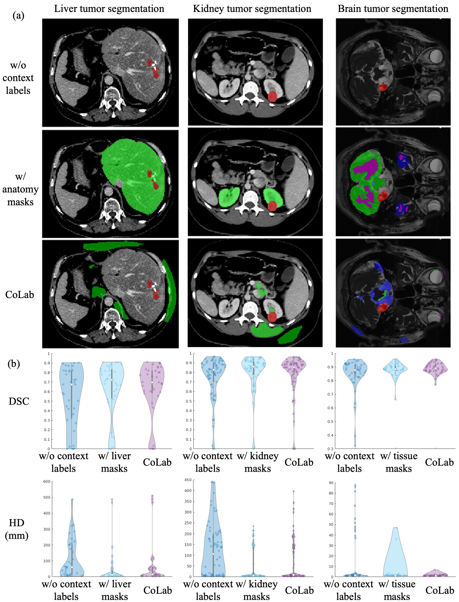

## Introduction

In semantic segmentation, background samples provide key contextual information for segmenting regions of interest (ROIs). Empirically, we find human-defined context labels (e.g., liver, kidney, brain tissue) provide additional anatomical information to benefit representation learning. For example, in the case of liver tumor segmentation, it is beneficial to also have labels for the liver available in addition to the tumor class. 

In this study, we further propose context label learning (CoLab), which automatically generates context labels to improve the learning of a context representation yielding better ROI segmentation accuracy based on a meta-learning scheme. CoLab can bring similar improvements when compared with training with human-defined context labels, without the need for expert knowledge.

<br/> <div align=center></div>

## Installation

For Conda users, you can create a new Conda environment using

```
conda create -n colab python=3.7
```

after activating the environment with 
```
source activate colab
```
try to install all the dependencies with

```
pip install -r requirements.txt
```
also install the conda environment for the jupyter notebook kernel.

```
python -m ipykernel install --user --name=colab
```

## Data and preprocessing

### Data downloading

We conduct experiments with several medical image segmentation datasets. Please consider downloading the datasets using follow links: 
- The datasets of liver tumor, colon tumor and pancreas tumor from [Medical Segmentation Decathlon](https://drive.google.com/drive/folders/1HqEgzS8BV2c7xYNrZdEAnrHk7osJJ--2). 
- Brain lesion dataset can be downloaded from [ATLAS](http://fcon_1000.projects.nitrc.org/indi/retro/atlas.html). 
- Brain tumor (Vestibular Schwannoma) dataset can be downloaded from [TCIA](https://www.cancerimagingarchive.net/collection/vestibular-schwannoma-seg/).
- Kidney tumor dataset can be downloaded from [KiTS19](https://github.com/neheller/kits19). 

We keep the downloaded data in `./datadownloaded`.

### Data preprocessing

We provide the pre-processing code for liver tumor segmentation, which is based on CT. Please refer to `datapreprocessing.ipynb` about intensity normalization, resampling etc. 

The example datasets are saved like:

```
datadownload/
├── Task03_Liver/
  ├── ImagesTr/
  └── LablesTr/
```

After obtaining the preprocessed data saved in `./datapreprocessed`, we generate the datafiles such as those in `./datafiles`.

## Training

Train the network without context labels.

```
python train.py --name CoLab_LiverTumor_Vanilla --tensorboard --split 0 --deepsupervision --taskcls 1 --liver0 0 --taskupdate 5 --vanilla --det --gpu 0
```

Training with human-defined labels. Note that it utilized additional liver masks.

```
python train.py --name CoLab_LiverTumor_ManualLabel --tensorboard --split 1 --deepsupervision --taskcls 2 --liver0 0  --manuallabel --det --gpu 0
```

Traing with CoLab. Please refer to the paper for more hyperparamter details.

```
python train.py --name CoLab_LiverTumor --tensorboard --split 0 --deepsupervision --taskcls 2 --liver0 0 --taskupdate 5 --distdetach --threshold_sub 30 --threshold_dev 20 --det --gpu 0
```

## Test

Test the trained model. Please remember to replace `SAVE_PATH` with the ones you save the trained model. You might also use this to visualize the generated context labels by CoLab.

Note that if you want to test you models trained without context labels, you should set `taskcls = 1`.

```
python test.py --resume SAVE_PATH/checkpoint.pth.tar --name CoLab_LiverTumor_test --liver0 0 --saveresults --taskcls 2 --deepsupervision --gpu 0
```


## Citation

```
@article{li2023context,
  title={Context Label Learning: Improving Background Class Representations in Semantic Segmentation},
  author={Li, Zeju and Kamnitsas, Konstantinos and Ouyang, Cheng and Chen, Chen and Glocker, Ben},
  journal={IEEE Transactions on Medical Imaging},
  year={2023},
  publisher={IEEE}
}
```